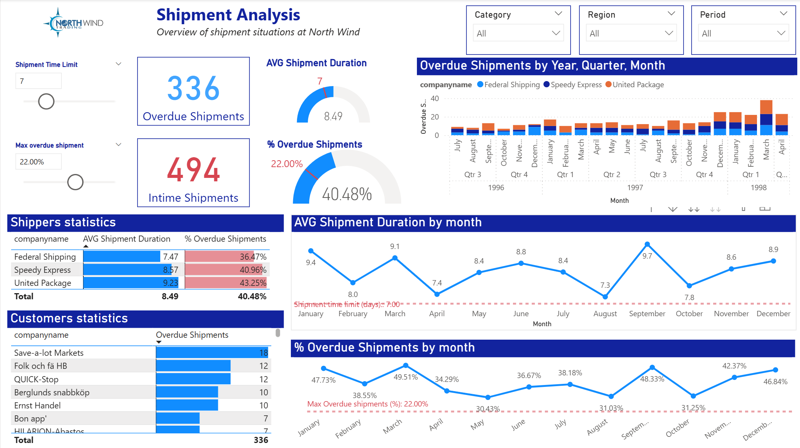
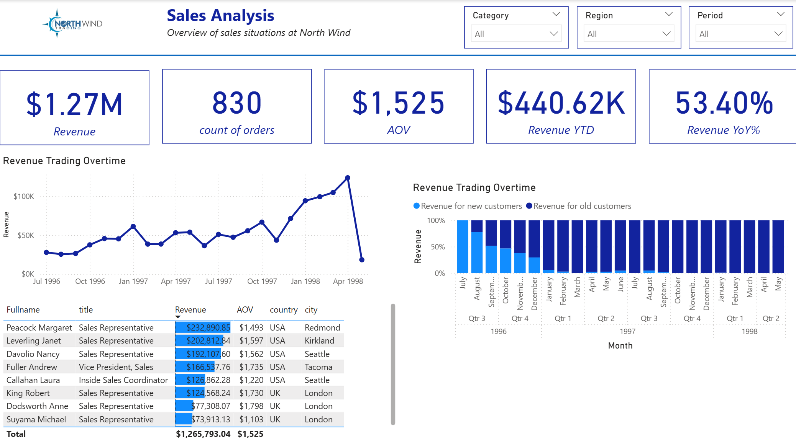

# North Wind Logistics & Sales Report
Báo cáo này được xây dựng bằng Power BI nhằm theo dõi doanh thu và hiệu suất giao hàng của doanh nghiệp Northwind theo thời gian. Northwind là doanh nghiệp chuyên nhập khẩu và xuất khẩu các loại thực phẩm đặc sản trên toàn cầu. Cơ sở dữ liệu mẫu được phát triển bởi Microsoft. 

# Nội dung chính của báo cáo
### 1. **Sales Analysis**
Phân tích hiệu quả doanh thu và đơn hàng:

- **Tổng quan doanh thu**: Tổng doanh thu, số lượng đơn hàng, AOV (Average Order Value), doanh thu YTD và tăng trưởng YoY.
- **Revenue Over Time**: Diễn biến doanh thu theo tháng.
- **Revenue by Customer Type**: Phân tích doanh thu từ khách hàng cũ và mới.
- **Sales by Representative**: So sánh hiệu quả làm việc của các nhân viên bán hàng.

### 2. **Shipment Analysis**
Phân tích tình trạng giao hàng:

- **Overdue vs. Intime Shipments**: Tổng số lô hàng đúng hạn và trễ hạn.
- **AVG Shipment Duration**: Thời gian giao hàng trung bình theo tháng và theo đối tác vận chuyển.
- **% Overdue Shipments**: Tỷ lệ đơn hàng giao trễ theo thời gian và nhà vận chuyển.
- **Shippers Statistics**: So sánh giữa các đơn vị vận chuyển.
- **Customers Statistics**: Danh sách khách hàng có nhiều đơn hàng trễ nhất.

### 3. **Ghi chú**
- **Bộ lọc động**: Theo danh mục sản phẩm, khu vực, thời gian.
- **Tooltip**: Báo các các sử dụng tooltip ở line chart và table 

---

## 🔍 Dữ liệu sử dụng

- **Nguồn dữ liệu**: Dữ liệu North Wind của Microsoft.
- **Thời gian dữ liệu**: Từ tháng 7/1996 đến tháng 5/1998.

---

## 📥 Cách sử dụng

1. Tải file `.pbix` từ repo này.
2. Mở bằng **Power BI Desktop** phiên bản **>= 2.135**.
3. (Tùy chọn) Kết nối lại với nguồn dữ liệu nếu có cấu hình cá nhân.

---

## 📸 Một số ảnh minh hoạ

### Shipment Analysis

### Sales Analysis

---

## 🤝 Đóng góp

Bạn có thể đóng góp bằng cách:

- Đề xuất cải tiến dashboard.
- Thêm tính năng phân tích mới.
- Báo lỗi về dữ liệu hoặc logic tính toán.

---

## 📬 Liên hệ

Nếu bạn có bất kỳ câu hỏi nào, vui lòng liên hệ qua:

- 📧 Email: [letuansg.07@gmail.com](mailto:letuansg.07@gmail.com)
- 🐙 GitHub: [github.com/letuanGithubVn1](https://github.com/letuanGithubVn1)

---
